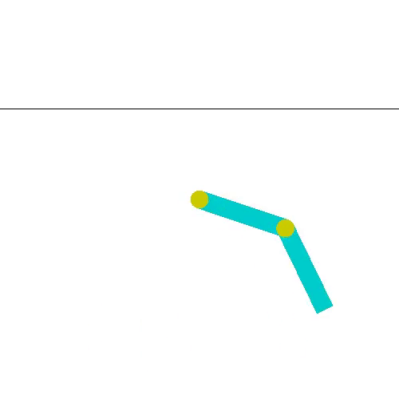
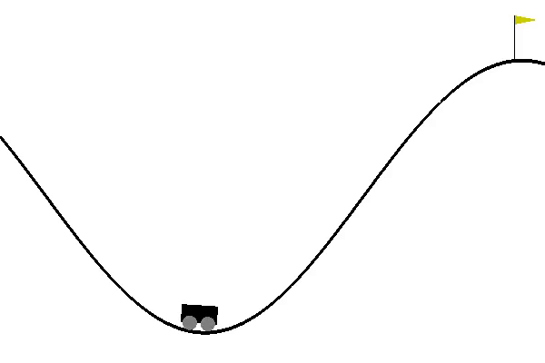

# LSPI  Least-Squares Policy Iteration

(LSPI) reinforcement learning algorithm is a model-free, off-policy method

https://www2.cs.duke.edu/research/AI/LSPI/nips01.pdf

 - LSQ: Learning the State-Action Value Function
 - LSPI uses LSQ to compute approximate Q function

#ToDoS
- Weighted importance sampling for off-policy
- Solving Acrobot env with LSPI

- 

-Solving mountainCar-v0 env with LSPI
- 

